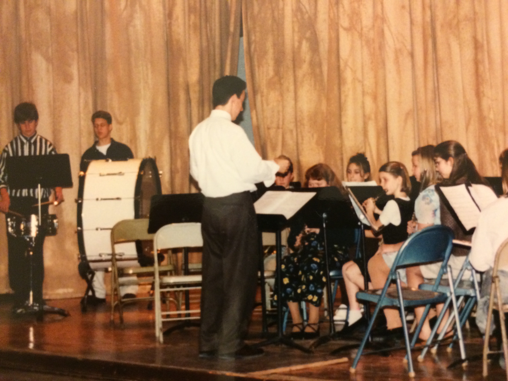
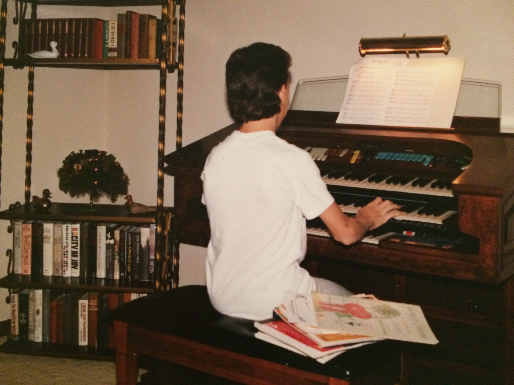
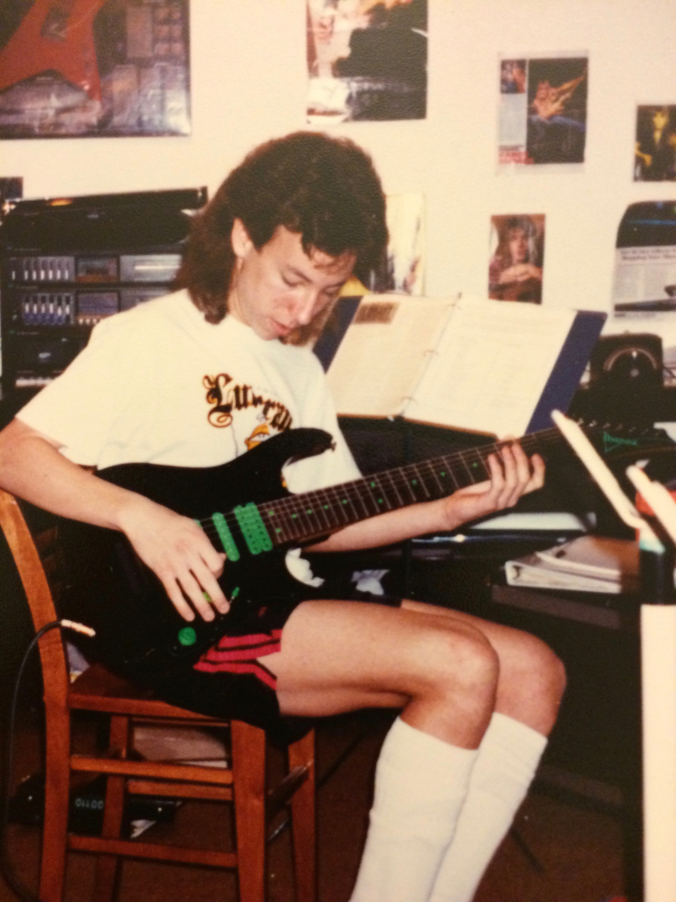
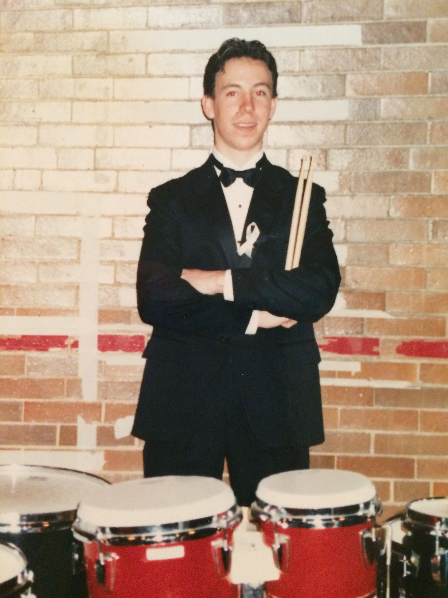

After high school graduation I mindlessly went to college because that's just what you do, I thought. In college, eventually you have to decide on a major. I chose music education. At the time, I don't remember giving this decision a great deal of thought. Instead, I had always played and loved music and my mother had been a teacher her entire life, so music education just kind of seemed like a good fit. The degree that I ended up with was a Bachelor of Education degree that entitled me to teach instrumental music (think band and orchestra) in kindergarten to high school.

My first real teaching job (I had already been teaching private music lessons for years at this point) came right after graduating from college in Kansas City, Missouri. Actually, I ended up getting a job at my former high school believe it or not! My responsibilities included band director and choir director for the high school in addition to band director at several feeder middle schools. 'Feeder' because the band students at these middle schools would most likely 'feed' the band program at the high school. I also helped out with coaching duties (soccer, basketball, track) and put on a high school musical every year. It was a small school and I was a jack of all trades, master of none.

This first job lasted for about five years or so. I enjoyed teaching and wrestling with being a new teacher. I distinctly remember the highs of putting on a great concert and seeing the looks of pride and exhilaration on the faces of students. The lows of a crappy day where the best laid plans failed miserably. The bond developed with the other teachers in the school and the shared desire to do a good job. However, in the end, a girl, a parent revolt over the play 'Grease', and an inner restlessness proved overwhelming, and I left that job and city and made a move to Chicago.

## The Windy City
In the two summers before leaving KC, I had begun a master's degree at Northwestern University outside of Chicago. The program was set up for educators to attend classes in the summer during their time off. I was able to attend during the regular school year and complete the program quickly. Northwestern has a great music program and I found myself drawn to two major areas within the field, technology and jazz. Music education has not really changed much in the last 50 plus years. Students were still learning the same old stuff, singing in large groups, playing somewhat outdated instruments like clarinet, violin, and trumpet, or going through a general music appreciation course about classical music. Music technology offered a glimpse into the possibilities of what music teaching _could be_!

Jazz, on the other hand, was ironically much like traditional music education, rooted in the past and somewhat outdated! (My apologies to any jazz aficionados who are undoubtedly aware of the thriving and exciting scene in jazz music that persists today.) My musical upbringing included learning the piano from the age of 6, picking up the guitar around 7th grade, and majoring in percussion (snare drum, timpani, marimba, etc.) and minoring in trumpet in undergrad. Guitar, however, had been my main instrument for most of my life and it was the instrument that I was intent on mastering in my jazz pursuits.

## All the practice in the world
At this point, it seems prudent to talk about practice. To most people, this word probably doesn't hold a great deal of meaning, but for musicians, it's a big deal! My early encounters with the word happened throughout elementary and middle school where my parents had to make me practice for upcoming weekly piano lessons. 'Have you practiced for your lesson?' or 'Did you fill out your practice sheet?' were common questions for me as a child. However, in high school, something weird happened and I became somewhat obsessed with practicing. I literally spent hours in the basement, practicing the electric guitar. I enjoyed this and became a pretty decent player.

In college, this practice habit persisted and even expanded. In addition to practicing the electric guitar, I studied the classical guitar with several top notch musicians in Chicago, AND had to practice percussion, piano (again), and the trumpet. That first teaching job in KC really ended the practicing, but when I left that job and moved to Chicago to finish the masters' degree, the practicing habit returned with a vengeance. This time, it was a full court press with jazz guitar! But more about that, later!

## Hello Sheboygan
With a shiny new master's degree in music education and an unhealthy jazz obsession, I moved a couple hours north to Sheboygan, Wisconsin where a high school buddy was teaching music. I original plan was to chill out for the summer and focus on some kind of music performance dream, but instead, I met some of the other teachers in town and was offered a teaching job at the high school for at-risk youth. It was hard to say no to a paycheck again so I accepted the job and ended up in Sheboygan for a number of years!

If you've never been to Sheboygan, Wisconsin, you should check it out if you're ever in the area. It's a really great small town on Lake Michigan and it fostered some of the best times and friends that I've ever had! In a nutshell, the first couple of years were colored by that jazz period during which I practiced during the majority of my time off, started getting weird and neglecting general hygiene, realized that I was never going to be a great jazz musician, and decided that I better start making some friends and having a life! This is the point at which I found an amazing group of friends, got my own house and a dog, and really lived some of the best years of my life.

## Time for another change
By now, I was a pretty experienced teacher. I had the fortune of creating several music programs that were pretty cutting edge for the time, at least in Wisconsin. Instead of teaching students the traditional music curriculum, I introduced guitars, pianos, computer-generated music and digital instruments, songwriting, and the like into the classroom. Besides teaching at the at-risk school, I taught at a public charter school that emphasized creativity in the arts, infused with subjects like science and social studies. These years were very rewarding and a welcomed challenge. My relationships with students and staff flourished and the years seemed to fly by.

In the end though, that inner restlessness stirred up again and I lost my passion for teaching. Up to that point, I really enjoyed teaching, working with students, and creating an environment for learning and growing. I've always said that teaching is a noble profession and I still believe it to this day. For me, however, it was time for something different. I had been happily dating for the last decade but never tied the knot, all of that was about to change. The next part of my adulting life was about to commence, and it involved a 1972 Airstream travel trailer, a new bride, and a year in Mexico!

<!-- [organ]: https://res.cloudinary.com/mimas-music/image/upload/v1559308200/Personal/IMG_0345.jpg
[guitar]: https://res.cloudinary.com/mimas-music/image/upload/v1559308200/Personal/vai1.jpg
[percussion]: https://res.cloudinary.com/mimas-music/image/upload/v1559308220/Personal/perc.jpg
[conductor]: https://res.cloudinary.com/mimas-music/image/upload/v1559308201/Personal/conductor.jpg -->
